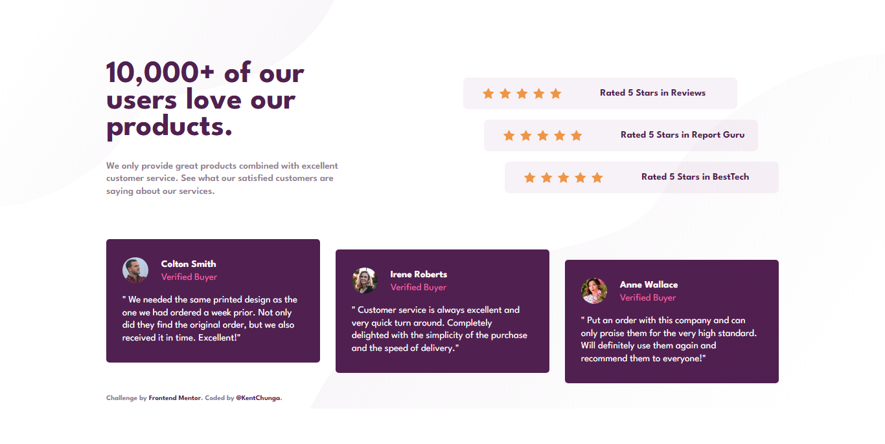
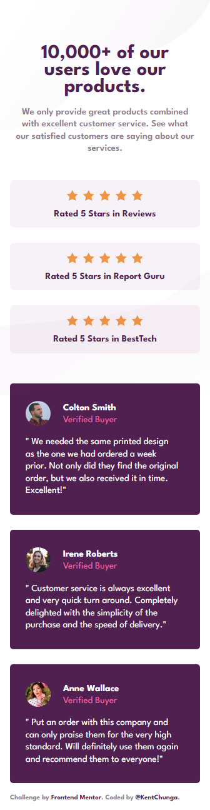

# Frontend Mentor - Social proof section solution

This is a solution to the [Social proof section challenge on Frontend Mentor](https://www.frontendmentor.io/challenges/social-proof-section-6e0qTv_bA). Frontend Mentor challenges help you improve your coding skills by building realistic projects. 

## Table of contents

- [Overview](#overview)
  - [The challenge](#the-challenge)
  - [ScreenshotS](#screenshotS)
  - [Links](#links)
- [My process](#my-process)
  - [Built with](#built-with)
- [License](#license)
- [Author](#author)

## Overview

### The challenge

Users should be able to:

- View the optimal layout for the section depending on their device's screen size

### ScreenshotS

#### Desktop preview

#### Mobile preview 

### Links

- Solution URL: [https://github.com/KentCP/Social-proof-section.git](https://github.com/KentCP/Social-proof-section.git)
- Live Site URL: [kentssocialproof.netlify.app](https://your-live-site-url.com)

## My process

### Built with

- Semantic HTML5 markup
- CSS custom properties
- Flexbox
- CSS Grid
- Mobile-first workflow

## Licence

This project is licensed under the terms of the MIT license.
Read the full [License](https://github.com/KentCP/Social-proof-section/blob/main/LICENSE).

## Author

- Frontend Mentor - [@KentCP](https://www.frontendmentor.io/profile/KentCP)
- Twitter - [@KentChuna](https://www.twitter.com/KentChunga)